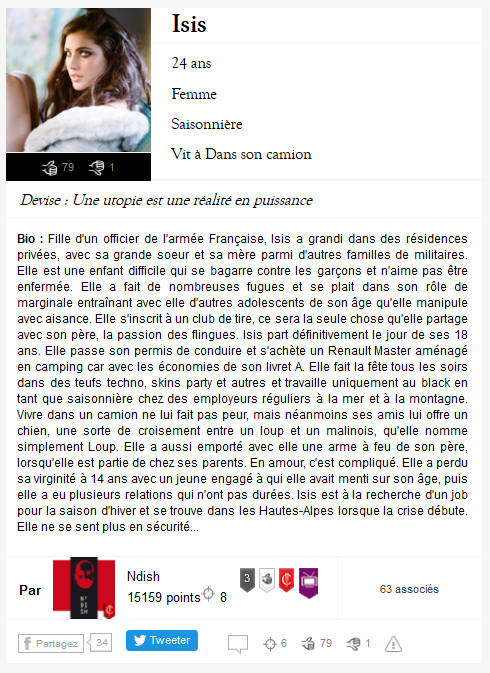

## L'autorité dans Anarchy

_Les constructions de l'autorité dans un dispositif de production littéraire collaborative&nbsp;: le cas de l'expérience transmédia Anarchy.fr_

&nbsp;

&nbsp;

<small>Nicolas Sauret / Ariane Mayer Iri, Centre Pompidou - 
Colloque Médiations informatisées de l'autorité GRIPIC, ISCC, ComSol - 17 & 18 mars 2016</small>

Note::

%%%%%%%%%%%%%%%%%%%%%%%%%%%%%%%%%%%%%%%%%%%%%

### Qu'est ce qu'Anarchy ?

* **Expérience transmédia** de France Télévisions
* 6 semaines (fin 2014)
* **Une fiction** : la France sort de l'euro
* **L'univers** : 1 site d'actualités alimenté par la Rédaction et les internautes
* **Un jeu, 3 modes de contributions** :
  * cadavre exquis : _les Héros de la Rédaction_
  * flux d'actualités : _le Fioul_
  * contributions littéraires : _«&nbsp;Vos personnages&nbsp;»_

§§§§§§§§§§§§§§§§§§§§§§§§§§§§§§§§§§§§§§§§§§§§§

  

§§§§§§§§§§§§§§§§§§§§§§§§§§§§§§§§§§§§§§§§§§§§§
### Qu'est ce qu'Anarchy ?

* **Expérience transmédia** de France Télévisions
* 6 semaines (fin 2014)
* **Une fiction** : la France sort de l'euro
* **L'univers** : 1 site d'actualités alimenté par la Rédaction et les internautes
* **Un jeu, 3 modes de contributions** :
  * cadavre exquis : _les Héros de la Rédaction_
  * flux d'actualités : _le Fioul_
  * contributions littéraires : _«&nbsp;Vos personnages&nbsp;»_

§§§§§§§§§§§§§§§§§§§§§§§§§§§§§§§§§§§§§§§§§§§§§
### Notre corpus : _&laquo;Vos personnages&raquo;_

<ul>
  <li>398 auteurs actifs (sur 2633 inscrits)</li>
  <li>1212 personnages</li>
  <li>11280 contributions originales</li>
  <li>soit l'équivalent d'un roman de 200 pages par jour.</li>
</ul>

  

§§§§§§§§§§§§§§§§§§§§§§§§§§§§§§§§§§§§§§§§§§§§§

  

  <i class="fa fa-arrow-right"></i>

  

§§§§§§§§§§§§§§§§§§§§§§§§§§§§§§§§§§§§§§§§§§§§§

  

  <i class="fa fa-arrow-right"></i>

  

%%%%%%%%%%%%%%%%%%%%%%%%%%%%%%%%%%%%%%%%%%%%%

## Concepts

&nbsp;

Spécificités de notre approche de l'autorité :  
&nbsp;

a) Caractère _littéraire_ du corpus  
b) Caractère *stratégique* de la constitution de l'autorité

§§§§§§§§§§§§§§§§§§§§§§§§§§§§§§§§§§§§§§§§§§§§§

#### a) Caractère _littéraire_

&nbsp;

Une autorité qui s'exerce sur deux types de récits et d'acteurs  

<small>Figure : _Circulation de l'influence dans Anarchy_</small>

§§§§§§§§§§§§§§§§§§§§§§§§§§§§§§§§§§§§§§§§§§§§§

#### b) Caractère *stratégique*

&nbsp;

L'autorité comme circulation, dynamique et processuelle

<small>Figure : _Circulation de l'autorité_</small>

Note::Le concept d’autorité fait appel à un certain nombre de notions connexes, comme par exemple l’influence, la visibilité, la notoriété (ou réputation), ou encore la légitimité. Si cette profusion sémantique et cette polysémie s’offrent en défi à toute réflexion sur l’autorité, nous voudrions dans cette recherche en délimiter la signification en fonction de deux contraintes :
-	Le caractère littéraire de notre corpus, qui impose une approche spécifique de l’idée d’autorité qu’on manipule. Ce qu’on cherche à voir, en effet, c’est la manière dont les auteurs (à travers leurs personnages, mais aussi leurs techniques et positionnements au sien du jeu), vont influencer de manière décisive le cours du récit Anarchy. La nature littéraire de notre corpus impose d’examiner l’autorité telle qu’elle s’exprime à l’égard de deux types d’acteurs et deux types d’énoncés (le récit des autres joueurs d’une part, et d’autre part le récit-cadre et les règles du jeu fixés par la Rédaction).
-	Le caractère stratégique de la construction de l’autorité dans le cadre d’un tel projet, qui exige de mettre en avant son aspect à la fois dynamique et relationnel par rapport à ces notions connexes, dans leur jeu d’inclusion et de dépendance. Il s’agira donc d’envisager l’autorité non pas comme une donnée statique mais comme une circulation où visibilité, notoriété, légitimité et influence s’imbriquent étroitement, fonctionnent comme des conditions de possibilité les unes des autres et dessinent toutes ensemble par leur relations mutuelles le processus qu’est l’autorité.
---
Dès lors, dans le contexte de la fiction collaborative Anarchy, nous pouvons penser la circulation à l’œuvre dans les stratégies de constitution de l’autorité selon ce schéma (slide). La distinction entre les notions connexes qu’on a mentionnées peut se lire du point de vue de leur relation (la visibilité est une condition de possibilité de la notoriété, qui en est une pour la légitimité, qui en est une pour l’influence), de leur statut (visibilité, notoriété et légitimité sont des états de fait là où l’influence est une capacité), et de leur cible (le public, les pairs, la Rédaction). Notre problématique théorique est de savoir, compte tenu ces précisions : quelles sont les relations entre écriture fictionnelle, auctorialité et autorité au sein d’un dispositif littéraire numérique participatif ?

%%%%%%%%%%%%%%%%%%%%%%%%%%%%%%%%%%%%%%%%%%%%%
### Modèle : triple approche
&nbsp; 

<table class="tg8">
  <tr>
    <th class="tg-6l08">1</th>
    <th class="tg-6l08">2</th>
    <th class="tg-6l08">3</th>
  </tr>
  <tr>
    <td class="tg-6l08">Approche quantitative</td>
    <td class="tg-6l09">Approche qualitative</td>
    <td class="tg-6l08">Approche organisationelle</td>
  </tr>
  <tr>
    <td class="tg-6l08"><i class="fa fa-arrow-down"></i></td>
    <td class="tg-6l09"><i class="fa fa-arrow-down"></i></td>
    <td class="tg-6l08"><i class="fa fa-arrow-down"></i></td>
  </tr>
  <tr>
    <td class="tg-6l08">autorité topologique</td>
    <td class="tg-6l09">autorité narrative</td>
    <td class="tg-6l08">autorité dispositive</td>
  </tr>
</table>

%%%%%%%%%%%%%%%%%%%%%%%%%%%%%%%%%%%%%%%%%%%%%
## 1. Approche topologique

Note:: La première approche a consisté à faire une analyse du réseau social des personnages créés par les internautes. Ce réseau est généré à partir des mentions intégrées dans les contributions littéraires des joueurs. Un script python a comptabilisé toutes les mentions d'un personnage à l'autre, générant une matrice carrée d'ordre 1212, correspondant au nombre de personnages. [Schema: mention to matrice]
Exploitée par le logiciel Gephi, cette matrice nous a permis de produire des représentations spatiales et d'effectuer un certain nombre de calcul statistiques sur le corpus.
Après nettoyage des personnages ayant joué et produit une histoire dans leur coin sans mentionner d'autres personnages, et se retrouvant ainsi hors-réseau, nous obtenons une graphe social de 514 noeuds (personnages), sur lequel un calcul de modularité nous permet d'identifier 8 communautés.
Ici, nous avons isolé les 3 **principales** communautés pour visualiser leurs relations. **Principales** au sens où elles rassemblent les principaux personnages influents.
Ces principaux personnages sont ceux qui se dégagent intuitivement en ayant suivi l'Actualité d'Anarchy, ou encore à posteriori à la lecture du livre de Marion Guénard, une des journalistes de la Rédaction.
Or, il est intéressant de remarquer que l'influence de ces personnages nous est largement confirmé par cette mesure de _centralité de vecteur propre_ qui est calculée à partir des mentions entrantes et sortantes d'un noeuds et indexée sur le degré de connectivité aux noeuds influents. Ainsi un lien vers ou depuis un personnage déjà influent est de plus forte valeur qu'un lien vers un personnage inconnu au bataillon.

§§§§§§§§§§§§§§§§§§§§§§§§§§§§§§§§§§§§§§§§§§§§§
### Description de l'approche

&nbsp;

  

    
    <!-- <small>Erick Foax @Laura</small> -->
  

  

    <i class="fa fa-arrow-right"></i>
  

  

    
  <table class="tg6">
    <tr>
      <th class="tg-031e"></th>
      <th class="tg-s6z2">Erick Foax</th>
      <th class="tg-s6z2">Laura</th>
    </tr>
    <tr>
      <td class="tg-031e">Erick Foax</td>
      <td class="tg-s6z2">-</td>
      <td class="tg-s6z2">1</td>
    </tr>
    <tr>
      <td class="tg-031e">Laura</td>
      <td class="tg-s6z2">0</td>
      <td class="tg-s6z2">-</td>
    </tr>
  </table>
  

  

    <i class="fa fa-arrow-right"></i>
  

  

    
  

    

§§§§§§§§§§§§§§§§§§§§§§§§§§§§§§§§§§§§§§§§§§§§§

<small>Figure : _Spatialisation générale avec personnages hors-réseau_</small>

§§§§§§§§§§§§§§§§§§§§§§§§§§§§§§§§§§§§§§§§§§§§§

<small>Figure : _Mise en évidence des 8 communautés de personnages_ (modularité = 0,357) </small>

§§§§§§§§§§§§§§§§§§§§§§§§§§§§§§§§§§§§§§§§§§§§§

<small>Figure : _Mise en évidence des 3 communautés principales_</small>

§§§§§§§§§§§§§§§§§§§§§§§§§§§§§§§§§§§§§§§§§§§§§

<table class="tg3">
  <tr>
    <th class="tg-031e">Personnage</th>
    <th class="tg-baqh">Centralité (Eigenvector)</th>
  </tr>
  <tr>
    <td class="tg-b7b8">France BN</td>
    <td class="tg-dzk6">1</td>
  </tr>
  <tr>
    <td class="tg-yw4l">FranceIndé</td>
    <td class="tg-baqh">0,961</td>
  </tr>
  <tr>
    <td class="tg-b7b8">Guy</td>
    <td class="tg-dzk6">0,941</td>
  </tr>
  <tr>
    <td class="tg-yw4l">Charlito</td>
    <td class="tg-baqh">0,869</td>
  </tr>
  <tr>
    <td class="tg-b7b8">EveillésManifeste</td>
    <td class="tg-dzk6">0,850</td>
  </tr>
  <tr>
    <td class="tg-yw4l">Victor</td>
    <td class="tg-baqh">0,847</td>
  </tr>
  <tr>
    <td class="tg-b7b8">Eric Sawal</td>
    <td class="tg-dzk6">0,847</td>
  </tr>
  <tr>
    <td class="tg-yw4l">Erick Foax</td>
    <td class="tg-baqh">0,797</td>
  </tr>
  <tr>
    <td class="tg-b7b8">Charles Vennec</td>
    <td class="tg-dzk6">0,789</td>
  </tr>
  <tr>
    <td class="tg-yw4l">Isis</td>
    <td class="tg-baqh">0,768</td>
  </tr>
  <tr>
    <td class="tg-b7b8">La Crête</td>
    <td class="tg-dzk6">0,722</td>
  </tr>
</table>

<small>Figure : _Mise en évidence de la centralité de vecteur propre des personnages_</small>

§§§§§§§§§§§§§§§§§§§§§§§§§§§§§§§§§§§§§§§§§§§§§
### Autorité topologique

&nbsp;

> l'influence d'un personnage sur le reste du réseau.

Note:: cette approche quantitative met en évidence les propriétés topologiques du réseau en matérialisant l'espace informationnel dans lequel évoluent les personnages d'Anarchy. _L'autorité topologique_ serait ainsi l'effet d'influence d'un personnage sur le reste du réseau.
Par exemple, le cas de FranceBN ....blabla si on a le temps

§§§§§§§§§§§§§§§§§§§§§§§§§§§§§§§§§§§§§§§§§§§§§
### Conclusion

&nbsp;

<i class="fa fa-arrow-right"></i> autorité ou mise en évidence de l'autorité ?

Note:: Notre corpus nous laisse penser que cette autorité topologique est finalement un état de fait, une représentation de l'autorité d'un personnage. Au contraire d'un réseau social s'inscrivant à la fois dans un temps long et dans un espace plus large, et pour lequel les effets de réseaux et les algorithmes produisent réellement des autorités, des dynamiques d'influence, etc.
Dans notre cas, l'autorité topologique ne serait en fait qu'une conséquence des deux autres volets que nous avons exploré.

%%%%%%%%%%%%%%%%%%%%%%%%%%%%%%%%%%%%%%%%%%%%%
## 2. Approche narrative

Note::Après l’analyse quantitative permettant de mettre en évidence la dimension topologique de l’autorité, une deuxième approche, qualitative, nous permet de réfléchir à sa dimension narrative à travers la construction par les joueurs d’une influence sur le récit des autres et sur le récit-cadre de la Rédaction.

§§§§§§§§§§§§§§§§§§§§§§§§§§§§§§§§§§§§§§§§§§§§§
### Description de l'approche

&nbsp;

<i class="fa fa-arrow-right"></i> Le cas du personnage La Crête (auteur : N'Dish)  
<i class="fa fa-arrow-right"></i> &Eacute;chantillon des contributions La Crête  
<i class="fa fa-arrow-right"></i> Tableau comparatif La Crête/Actualités

Note:: **Description de l’approche**: Pour ce faire, on a choisi de se concentrer sur un person-nage particulier : La Crête (leader des Oubliés, un groupe de personnages anarcho-révolutionnaires). Si son auteur ne fait pas partie du trio gagnant (N’Dish arrive en 7ème position), La Crête est doublement intéressant en raison, d’une part, de ses multiples initiatives narratives qui ont connu de larges répercussions (attentats, sièges, assauts des forces de l’ordre), et d’autre part, de son bras de fer avec la Rédaction qui a poussé cette dernière à faire évoluer les règles du jeu dans le sens d’un assouplissement de la chaîne de production. Dans le but d’analyser les stratégies par lesquelles N’Dish a tenté d’accroître sa visibilité, sa notoriété, sa légitimité et son influence, nous nous sommes appuyés sur deux corpus de données qu’on a mis en regard l’un de l’autre : 1) l’ensemble des billets publiés par La Crête dont on a relevé les événements marquants, et 2) le récit-cadre de la Rédaction, en ce que celle-ci relaie (ou non) les initiatives de La Crête dans son fil d’actualité. Cette comparaison nous a permis d’élaborer un tableau aidant à sa visualisation (slide).

§§§§§§§§§§§§§§§§§§§§§§§§§§§§§§§§§§§§§§§§§§§§§

<table class="tg4">
  <tr>
    <th class="tg-yw4l">ID</th>
    <th class="tg-yw4l">Date</th>
    <th class="tg-yw4l">Personnage</th>
    <th class="tg-yw4l">Auteur</th>
    <th class="tg-yw4l">Titre</th>
    <th class="tg-yw4l">Evénements</th>
    <th class="tg-yw4l">Adresses</th>
    <th class="tg-yw4l">Remarques</th>
  </tr>
  <tr>
    <td class="tg-kjho">7735</td>
    <td class="tg-kjho">2014-11-21 14:45:15</td>
    <td class="tg-kjho">La Crête</td>
    <td class="tg-kjho">Ndish</td>
    <td class="tg-kjho">A l'attaaaaaaaaaaaque !</td>
    <td class="tg-kjho">Apprend qu'Isis est en prison;critique les Eveillés;Rencontre Eric Sawal qu'il intègre à son armée</td>
    <td class="tg-kjho">Victor; Charlito; Guy; Lilou; Eric Sawal</td>
    <td class="tg-kjho">La Crête étend son réseau</td>
  </tr>
  <tr>
    <td class="tg-3we0">7867</td>
    <td class="tg-3we0">2014-11-21 13:56:56</td>
    <td class="tg-3we0">eric-sawal</td>
    <td class="tg-3we0">Eric Sawal</td>
    <td class="tg-3we0">21 Nov - Isis en taule</td>
    <td class="tg-3we0">S'adresse à La Crête: vient d'apprendre que les amis de la Crête Ellie, Isis et Juan sont en prison; se dit prêt à se joindre à lui pour les libérer</td>
    <td class="tg-3we0">La Crête; Juan; Isis; Ellie</td>
    <td class="tg-3we0"></td>
  </tr>
  <tr>
    <td class="tg-3we0">7878</td>
    <td class="tg-3we0">2014-11-21 15:09:33</td>
    <td class="tg-3we0">eric-sawal</td>
    <td class="tg-3we0">Eric Sawal</td>
    <td class="tg-3we0">21 Nov - En route avec La Crête</td>
    <td class="tg-3we0">Rejoint La Crête dans son plan de sauvetage d'Isis, Juan et Ellie; se dit prêt à mourir</td>
    <td class="tg-3we0">La Crête; Juan; Isis; Ellie</td>
    <td class="tg-3we0"></td>
  </tr>
  <!-- <tr>
    <td class="tg-3we0">7898</td>
    <td class="tg-3we0">2014-11-21 18:28:18</td>
    <td class="tg-3we0">guy</td>
    <td class="tg-3we0">Gally</td>
    <td class="tg-3we0">la constituante</td>
    <td class="tg-3we0">Affirme au nom des éveillés des réflexions sur le programme politique qui permettra de sortir de la crise et les moyens de l'atteindre. Critique ceux qui posent des bombes comme La Crête.</td>
    <td class="tg-3we0">Un Petit Rien; Bias de Priène; Gritusse; Tiphaine; Victor; Charlito; Auguste Baboeuf; Stelise; Alex V.; Capucine Cher; Marianne Guérin; Parti européiste; justin tresor; Liza Papanov; Lilou; Tous Ensemble; Walter</td>
    <td class="tg-3we0">La Crête critiqué pour ses actions violentes</td>
  </tr>
  <tr>
    <td class="tg-3we0">7900</td>
    <td class="tg-3we0">2014-11-21 18:50:01</td>
    <td class="tg-3we0">victor</td>
    <td class="tg-3we0">climo</td>
    <td class="tg-3we0">La Crète</td>
    <td class="tg-3we0">Evoque la même scène que Gally au post précédent: La Crête en punk-à-chien qui demande qui est le taulier ici, Victor répond qu'il n'y a pas de chef</td>
    <td class="tg-3we0">Guy; La Crête</td>
    <td class="tg-3we0"></td>
  </tr> -->
  <tr>
    <td class="tg-kjho">7975</td>
    <td class="tg-kjho">2014-11-22 12:08:05</td>
    <td class="tg-kjho">La Crête</td>
    <td class="tg-kjho">Ndish</td>
    <td class="tg-kjho">SVP</td>
    <td class="tg-kjho">S'adresse à Eric Sawal sur la stratégie pour leur assaut du commissariat de Boulogne B. visant à libérer leurs copains</td>
    <td class="tg-kjho">Eric Sawal</td>
    <td class="tg-kjho">La Crête force de proposition: soumet directement à Eric Sawal un plan.</td>
  </tr>
  <tr>
    <td class="tg-3we0">8031</td>
    <td class="tg-3we0">2014-11-22 14:52:28</td>
    <td class="tg-3we0">eric-sawal</td>
    <td class="tg-3we0">Eric Sawal</td>
    <td class="tg-3we0">Le plan de La Crête</td>
    <td class="tg-3we0">Eric se dit d'accord avec le plan de La Crête mais il faut éviter au maximum la violence</td>
    <td class="tg-3we0">La Crête</td>
    <td class="tg-3we0">Atteste de l'influence de La Crête au niveau narratif: plan accepté et Eric suit son initiative</td>
  </tr>
  <tr>
    <td class="tg-kjho">8069</td>
    <td class="tg-kjho">2014-11-22 19:22:16</td>
    <td class="tg-kjho">La Crête</td>
    <td class="tg-kjho">Ndish</td>
    <td class="tg-kjho">Sur un air de Wagner</td>
    <td class="tg-kjho">Attaque du commissariat de B. Billancourt;La Crête se prend deux balles;Isis est libérée mais blessée aussi</td>
    <td class="tg-kjho">Eric Sawal; Juan; Ellie; Amandine</td>
    <td class="tg-kjho">Narration d'une attaque dont La Crête est le meneur</td>
  </tr>
  <tr>
    <td class="tg-3we0">8400</td>
    <td class="tg-3we0">2014-11-23 11:26:15</td>
    <td class="tg-3we0">eric-sawal</td>
    <td class="tg-3we0">Eric Sawal</td>
    <td class="tg-3we0">Se coordonner dans la lutte</td>
    <td class="tg-3we0">Eric reproche un manque de coordination dans la lutte de la part de La Crête et Isis; il leur demande où ils ont placé des bombes et refuse pour sa part d'en faire sauter</td>
    <td class="tg-3we0">La Crête; Isis</td>
    <td class="tg-3we0"></td>
  </tr>
  <!-- <tr>
    <td class="tg-3we0">8403</td>
    <td class="tg-3we0">2014-11-23 11:50:50</td>
    <td class="tg-3we0">victor</td>
    <td class="tg-3we0">climo</td>
    <td class="tg-3we0">La Terreur</td>
    <td class="tg-3we0">Apprend et condamne les attentats de La Crête et autres Oubliés. Discute avec Guy parmi les éveillés dans l'objectif de créer une nouvelle constitution d'ici 15 jours</td>
    <td class="tg-3we0">La Crête; Guy; Tiphaine; Lilou</td>
    <td class="tg-3we0">La Crête reconnu dans son pouvoir d'influence: "maintenant c'est lui qui mène la danse"</td>
  </tr> -->
</table>

<small>Tableau : _&Eacute;chantillons des contributions_ de _et_ à _La Crête_</small>

§§§§§§§§§§§§§§§§§§§§§§§§§§§§§§§§§§§§§§§§§§§§§

<table class="tg1">
  <tr>
    <th class="tg-yw4le">Date</th>
    <th class="tg-yw4le">Evénements Actualité</th>
    <th class="tg-yw4le">Evénements La Crête</th>
    <th class="tg-yw4le">Evénements @La Crête</th>
    <th class="tg-yw4le">Autres Evenements</th>
    <th class="tg-yw4le">Remarques Narration</th>
  </tr>
  <tr>
    <td class="tg-yw4le">21/11/14</td>
    <td class="tg-yw4le">Gerard Larcher, président intérimaire Deuil national</td>
    <td class="tg-yw4le">Isis est en prison Organisation d'un plan de sauvetage</td>
    <td class="tg-yw4le">Gally et victor: Critiques sur le mode d'action de La Crête</td>
    <td class="tg-yw4le"></td>
    <td class="tg-yw4le"></td>
  </tr>
  <tr>
    <td class="tg-yw4le">22/11/14</td>
    <td class="tg-yw4le">Boites noires illisibles Le spectre des oubliés sur ParisRéactions à la prime de 10K</td>
    <td class="tg-yw4le">Attaque du commissariat, la Crête se prend deux balles, Isis blessée mais libérée aussi</td>
    <td class="tg-yw4le">Eric Sawal d'accord avec plan de la Crête et le suit</td>
    <td class="tg-yw4le"></td>
    <td class="tg-yw4le"></td>
  </tr>
  <tr>
    <td class="tg-yw4le">23/11/14</td>
    <td class="tg-yw4le">Un suspect arrêté pour le crash Récit des méfaits des Oubliés Attentats suite à l'évasion de la porte-parole des Oubliés</td>
    <td class="tg-yw4le"></td>
    <td class="tg-yw4le">Soutiens et critiques.  Eric Sawal reproche à la Crête un manque de coordination dans la lutte,  Victor dénonce les bombes;  Erick foax soutient les révolutionnaires dont la Crête</td>
    <td class="tg-yw4le"></td>
    <td class="tg-yw4le">La Rédaction maintient sa version, mais ouvre une deuxième piste proposée par un personnage (Erick Foax) Reprise de l'histoire de Ndish</td>
  </tr>
</table>

<small>Tableau :  _Extrait du tableau comparatif des chronologies Actualités / La Crête_</small>

§§§§§§§§§§§§§§§§§§§§§§§§§§§§§§§§§§§§§§§§§§§§§
### Résultats

&nbsp;

Influence de La Crête sur :

a) le récit des autres joueurs  
b) le récit-cadre de la Rédaction

Note:: **Résultats**:
* **Influence sur les autres joueurs**: Pour résumer les résultats que la lecture du ta-bleau a fait apparaître, nous avons pu dégager chez La Crête, d’abord, trois stratégies de construction d’une influence sur ses pairs. La première est le tra-vail littéraire que fait N’Dish sur le caractère de son personnage, qu’il dote d’une autorité charismatique et d’une force d’initiative en mentionnant d’autres personnages dans ses billets pour qu’ils le suivent dans ses actions. Cela lui permet de se donner une visibilité d’où résulte son influence narrative. La se-conde stratégie est le travail de N’Dish sur l’impact citationnel de son person-nage, à travers sa capacité à relayer de l’information, mais aussi à demander aux autres de relayer ses propres actions (en particulier les organes de « presse indépendante » comme FranceBN). En se constituant comme nœud narratif et informationnel, il établit sa notoriété qui lui confère une influence qu’on pour-rait appeler médiatique (à l’image des retweet sur Twitter). Enfin, sa troisième stratégie est un travail sur la représentation de l’auteur lui-même, à travers une justification de son positionnement et la constitution d’un réseau de collabora-tions. Ce travail sur la figure auctoriale et sa démarche lui permet d’instaurer sa légitimité sur laquelle il peut bâtir une influence organisationnelle. Ces diverses stratégies ont été couronnées d’un succès qu’attestent à la fois le suivi de ses initiatives narratives, la densité de ses citations et relais par d’autres joueurs ainsi qu’une reconnaissance qualitative (« maintenant, c’est lui qui mène la danse », dit l’un d’eux, Victor).
* **Influence sur la Rédaction**: Ensuite, en ce qui concerne son influence narrative sur la Rédaction, elle s’exprime moins dans son poids sur le récit-cadre que dans son pouvoir d’inflexion du dispositif. On a noté que le fil d’actualité ne relayait que tardivement les actions de La Crête, mais qu’il était en revanche le premier personnage à en influencer grandement le cours. Mais outre cet impact sur l’arche narrative, l’auteur N’Dish a surtout contribué à ce que la Rédaction modifie les règles du jeu, en révisant à la baisse les rythmes de production, afin de laisser plus de marge aux joueurs qui, comme N’Dish, s’échinent à écrire des histoires qui ne sont que fort peu relayées (« grand virage », 20 novembre).

§§§§§§§§§§§§§§§§§§§§§§§§§§§§§§§§§§§§§§§§§§§§§
#### a) Influence sur les autres joueurs

&nbsp;

<i class="fa fa-arrow-right"></i> Visibilité et influence narrative  
<i class="fa fa-arrow-right"></i> Notoriété et influence médiatique  
<i class="fa fa-arrow-right"></i> Légitimité et influence organisationnelle

 

 <!--  -->

§§§§§§§§§§§§§§§§§§§§§§§§§§§§§§§§§§§§§§§§§§§§§
#### b) Influence sur la Rédaction

&nbsp;

<i class="fa fa-arrow-right"></i> Impact sur l'arche narrative  
<i class="fa fa-arrow-right"></i> Pouvoir d'inflexion du dispositif

§§§§§§§§§§§§§§§§§§§§§§§§§§§§§§§§§§§§§§§§§§§§§
### Conclusions

&nbsp;

Une dynamique ambivalente de l'autorité, entre :
* autoritativité numérique (E. Broudoux)
* et régime d'autorité plus classique (charisme et légitimité, M. Weber)

Note:: **Conclusions**: On peut en conclure que l’autorité (entendue ici comme influence narrative) obéit à une dynamique ambivalente. D’un côté, elle semble se rattacher aux pra-tiques autoritatives (Broudoux), propres à l’espace numérique, par où un scripteur s’autorise lui-même et fixe les conditions de sa légitimité. C’est ce dont témoigne le bras de fer de La Crête avec la Rédaction qui est allée jusqu’à aménager les règles du jeu, ce qui n’est possible que dans le cadre d’un projet qui, comme cette fiction numérique, présente une certaine souplesse du dispositif. Mais d’un autre côté, les stratégies de La Crête semblent hériter de figures plus classiques de l’autorité wébérienne (cha-rismatique et légitime). Comme on l’a vu avec son influence sur les autres joueurs, N’Dish utilise le charisme de sa personne pour établir peu à peu sa légitimité. Loin de s’effacer dans un tel projet collaboratif, la notion d’autorité y persiste en fait sous un nouveau visage : construction hybride où se croisent des dynamiques héritées de l’imprimé et des pratiques spécifiquement digitales, elle nous indique qu’il faut toujours être autorisé, quitte à s’autoriser soi-même, pour exister dans l’histoire.

%%%%%%%%%%%%%%%%%%%%%%%%%%%%%%%%%%%%%%%%%%%%%
## 3. Approche dispositive

Note::définir ce que j'entends par cette approche

§§§§§§§§§§§§§§§§§§§§§§§§§§§§§§§§§§§§§§§§§§§§§
### préambule : sur le dispositif

&nbsp;

Du dispositif foucauldien au dispositif _anarchyque_

&nbsp;

<small>Albera F. et Tortajada M. (2011). _« Le dispositif n’existe pas ! »_  
dans François Albera et Maria Tortajada (dir.), Ciné-dispositifs: spectacles, cinéma, télévision, littérature, L’Âge d’homme, Lausanne, pp. 13-38.</small>

&nbsp;

<i class="fa fa-arrow-right"></i> dispositif transmédia d'écriture collaborative

Note::Notre troisième approche s'appuie sur l'étude du dispositif. La notion de dispositif est évidemment problématique, en témoigne les différentes tentatives de définitions, de Foucault à Agamben, en passant par Bachimont. Ces travaux fameux mettent en avant le caractère **déterministe** du dispositif, or il nous semble que les dispositifs, numériques tout du moins, **suscitent** des pratiques plutôt que ne les déterminent.
C'est pourquoi nous avons voulu nous écarter un peu de ces travaux, et il nous a semblé plus productif de favoriser une étude empirique, ancrée dans notre corpus pour en tirer une analyse propre au terrain et à notre discipline.
C'est un peu la démarche de François Albera et Maria Tortajada sur le dispositif cinématographique, modèle que nous avons repris et simplifié, mais en considérant ici **un dispositif transmédia d'écriture collaborative**.

§§§§§§§§§§§§§§§§§§§§§§§§§§§§§§§§§§§§§§§§§§§§§

<table class="tg2">
  <tr>
    <th class="tg-s6z2"></th>
    <th class="tg-c9cr">Dimensions</th>
    <th class="tg-jogk">soit dans Anarchy</th>
  </tr>
  <tr>
    <td class="tg-baqh">1</td>
    <td class="tg-yw4l"><strong>Environnement-support</strong> (Zacklad)</td>
    <td class="tg-yw4l">Matériel, applicatifs, système d’exploitation et infrastructure réseau</td>
  </tr>
  <tr>
    <td class="tg-baqh">2</td>
    <td class="tg-yw4l"><strong>Représentations</strong></td>
    <td class="tg-yw4l">Agencement des différents modules dans le site ou dans l'application mobile : mise en espace, aspects éditoriaux, points d'entrées dans les contenus et modalités de navigation</td>
  </tr>
  <tr>
    <td class="tg-baqh">3</td>
    <td class="tg-yw4l"><strong>Cercle magique</strong> (Huitzinga)</td>
    <td class="tg-yw4l">Règles du jeu et leurs expressions dans l'interfaces (les points, les votes, les injonctions à contribuer), mais aussi leur encodage dans les dimensions techniques</td>
  </tr>
  <tr>
    <td class="tg-baqh">4</td>
    <td class="tg-yw4l"><strong>Acteurs</strong></td>
    <td class="tg-yw4l">L'équipe de rédaction, son organisation spatiale, ses process de rédaction/validation, les joueurs</td>
  </tr>
</table>

<small>Tableau : _Les 4 dimensions du dispositif transmédia_</small>

Note:: Dans ce tableau, nous identifions 4 dimensions qui s'agencent en tant que telle et non comme des strates.
* La première concerne l'infrastructure technique sur laquelle l'expérience Anarchy a reposé pendant 6 semaines.
* La seconde concerne les représentations, cad l'affichage visuel des données aux travers de différents modules fonctionnels, et dont l'agencement constitue les interfaces du site et de l'application mobile. Ces représentations sont l'interface interactive et performative entre les acteurs et les données.
* la troisième, le cercle magique en référence aux travaux de Huitzinga sur la théorie du jeu, est celle qui a retenu notre attention comme composante principale de l'autorité dispositive. Dans ce cercle nous incluons les règles du jeu, et leurs expressions dans l'interface (les points, les votes, les injonctions à contribuer), mais aussi leur encodage dans les dimensions techniques.
* La quatrième concerne les acteurs, _participant_ eux-aussi du dispositif dans la mesure où ils s'agencent également dans l'espace, celui physique de la Rédaction, mais aussi dans l'environnement numérique, régissant les modalités d'actions de chacun.

§§§§§§§§§§§§§§§§§§§§§§§§§§§§§§§§§§§§§§§§§§§§§
### _&laquo;Action dispositive&raquo;_

<small>Louise Merzeau (2013). _Éditorialisation collaborative d’un événement._  
Communication et organisation, (43), 105–122.  
http://doi.org/10.4000/communicationorganisation.4158</small>

&nbsp;

<i class="fa fa-arrow-right"></i> le dispositif comme **une dynamique**

<i class="fa fa-arrow-right"></i> le dispositif comme **conditions de possibilité de la production de la fiction**

Note::Dans cette typologie, on retrouve la notion d'_action dispositive_ décrite par Louise Merzeau lorsqu'elle identifie le dispositif comme une dynamique (Merzeau, 2013) plutôt qu'un support. On pourrait dans notre cas parler d'**écriture dispositive**. C'est-à-dire dans Anarchy, la dynamique qui régit la production de la fiction par ses différents acteurs.
En ce sens, le dispositif n'est pas une simple armature soutenant la fiction, mais relève davantage **des conditions de possibilité de la production de la fiction**.

§§§§§§§§§§§§§§§§§§§§§§§§§§§§§§§§§§§§§§§§§§§§§
### Autorité dispositive

> la série de contraintes générées par le dispositif que l'utilisateur prend en compte dans son usage.

&nbsp;

<i class="fa fa-arrow-right"></i> une autorité _bienveillante_

<i class="fa fa-arrow-right"></i> une autorité comme **prédisposition des modalités d'écriture de la fiction**

Note::Les quatres dimensions décrites précédemment constitue ensemble une série de contraintes qui définissent le dispositif transmédia Anarchy.
Nous appelons _autorité dispositive_ la **série de contraintes** générées par le dispositif au sens large et que l'utilisateur prend en compte dans son usage.
Cette prise en compte ne consiste pas nécessairement à en épouser la forme et à s'y conformer, mais suppose de considérer le dispositif, de l'apprécier et d'en exploiter les contraintes qui _prédisposent_ l’usage, et qui l'accueillent. Contournement, détournement, optimisation.
En obligeant l'utilisateur à adapter ses modalités d'action, le dispositif émet bien une certaine autorité. Mais cette autorité me fait penser davantage à **de la bienveillance** que du déterminisme, _bienveillance dispositive_ donc, terme que je reprends à Louise Merzeau, elle-même citant le texte d'Emmanuel Belin "De la bienveillance dispositive" (1999).
Finalement, il s'agit bien d'une prédisposition des modalités d'écriture de la fiction : modalités de collaboration, modalités temporelles, modalités environnementales, etc.

<!-- * le texte comme tissu de citation préexistante : recyclage/remix
* braconnage (De Certeau) et _textual poachers_ de Jenkins -->

%%%%%%%%%%%%%%%%%%%%%%%%%%%%%%%%%%%%%%%%%%%%%
### Articulation des trois autorités

&nbsp;

Autorité    | Objet | Transaction
:--|:--|:--
dispositive |  agencement de l'espace           | le dispositif autorise les auteurs
narrative   |  écriture dans _(et de)_ l'espace | les auteurs s'autorisent et autorisent leur pairs
topologique |  représentation de l'espace       | la spatialité manifeste l'autorité

<!--

Autorité    |   | Objet | Acteur ?
:--|:--|:--|:--
dispositive | <i class="fa fa-arrow-right"></i>  | le dispositif agence l'espace informationnel | il autorise les auteurs
narrative   | <i class="fa fa-arrow-right"></i>  | les auteurs écrivent dans _(et de)_ l'espace et agence la fiction | ils autorisent leurs pairs
topologique | <i class="fa fa-arrow-right"></i>  | mise en évidence de l'état de fait créé par cette double dynamique autoritative/autoritaire/d'autorité | représentation de l'espace
-->

Note::Nous voici donc avec 3 autorités, toute maintenant un lien étroit avec l'espace qu'elles agencent.
<redire ce qu'elle sont : autorité "de" ... "sur" ...>
* Finalement, les auteurs s'autorisent à agir et à écrire et construire leur propre autorité (influence sur les pairs et sur la fiction)
  * ... en s'inscrivant dans un dispositif (qui les autorisent), et ce double mouvement d'autorité produit un état de fait, un équilibre.
  * , et influence leur pairs, c'est plutôt la qualité narrative ici qui finit par influencer, mais pas seulement.
* L'autorité topologique n'est que la représentation de cet état de fait qui met en évidence les deux autres autorités.

%%%%%%%%%%%%%%%%%%%%%%%%%%%%%%%%%%%%%%%%%%%%%

## Merci !
&nbsp;

Carnet de recherche : [lakonis.github.io/behindanarchy/](http://lakonis.github.io/behindanarchy/)

&nbsp;

&nbsp; | contacts
:--|:--
**Nicolas Sauret** | _nicolas.sauret@iri.centrepompidou.fr @nicolasauret_
**Ariane Mayer** | _ariane0mayer@gmail.com_

&nbsp;

<small>Colloque Médiations informatisées de l'autorité GRIPIC, ISCC, ComSol - 17 & 18 mars 2016</small>
